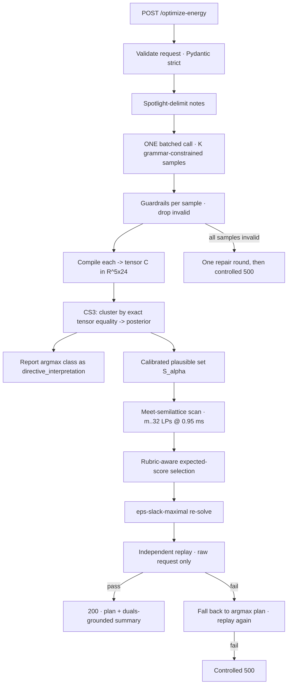

# CLAMP — Constraint-Lattice Ambiguity-Margin Planning

A refinement of [IMPLEMENTATION_PLAN.md](IMPLEMENTATION_PLAN.md) for the BUP CSE Fest 2026
GridWise preliminary. Written 18 September 2026. References are in
[RESEARCH_LINKS.md](RESEARCH_LINKS.md).

The existing plan is a good conventional pipeline. This document keeps its correct core, names
the one place it leaves points on the table, and replaces that stage with an architecture and
algorithm that — as far as the 2025–2026 literature goes — nobody has published.

Everything numeric below was measured in this repository's scratch scripts against the ten
public cases, not estimated. Reproduction commands are in §8.

---

## 1. Verdict on the existing plan

### Keep, unchanged

| Decision | Why it stands |
|---|---|
| 96-variable signed-flow LP (`g`, `s`, `b`, `e` per hour), `scipy.optimize.linprog(method="highs")` | **Verified exact.** It reproduces all ten published reference costs to 0.0000 BDT. The signed battery flow makes simultaneous charge/discharge structurally impossible and needs no integers. |
| Independent replay verifier that rebuilds arrays from the raw request rather than reusing the compiler's output | This is the single most valuable defensive idea in the plan. A compiler bug that fools both solver and checker is the realistic failure mode. |
| Reserve = `max` of base and directive; grid cap = `min`; charge/discharge prohibitions = union | Correct, and — see §3 — these are the first three rows of a lattice the plan did not notice it had already built. |
| Refusing to invent an official composition rule for overlapping `solar_reduction` | Right instinct. §2 gives it a defensible default instead of an open question. |
| Deterministic, template-generated `plan_summary`; no second model call on the critical path | Correct. Costs nothing, cannot hallucinate savings. |
| Frozen module interfaces before parallel work starts | Correct for a two-person four-hour round. |

### Fix

| # | Problem | Consequence |
|---|---|---|
| 1 | **One model sample, one optional repair.** | The pipeline has no signal for *"the model may be wrong here."* The rubric's two largest line items — 5 pts paraphrase robustness and 10 pts ground-truth directive application — are exactly the ones a single greedy sample cannot defend. Both [Saparina & Lapata (ACL 2025)](https://aclanthology.org/2025.findings-acl.863/) and [Stengel-Eskin et al. (ICLR 2024)](https://arxiv.org/abs/2306.00824) show LLMs emit only their *preferred* reading of an ambiguous utterance and that their confidence does not track the ambiguity. Hidden notes are paraphrases. Paraphrase is ambiguity. |
| 2 | **It assumes the reported interpretation and the scheduled constraints must be the same object.** | They are scored separately, and §11.2 of the problem statement says the judge *"replays the plan using the true hidden directive, not only the team-reported interpretation."* Reporting and scheduling can be decoupled. That is the opening the whole of §3 walks through. |
| 3 | "Selective semantic review" by a second model, listed as an optional extra. | Right instinct, wrong mechanism: adjudicating *text* is slow, unmeasurable, and the plan itself admits structural validation cannot confirm semantics. Voting in **constraint space** is exact, free, and on the critical path for 15 ms. |
| 4 | Counterfactual re-solve demoted to "optional, after core gates". | It costs ~1 ms and the duals come back from HiGHS for free. It grounds the rubric-visible `plan_summary` and is the strongest 20 seconds available in the 3-minute video. Promote it. |
| 5 | "At most two model attempts" stated as a global budget. | This silently forbids an ensemble. Restate: **one batched call returning K samples** (one round-trip), plus at most one repair round. K samples is not K calls. |
| 6 | Eval suite specified as 60 independent cases. | Make it **12 paraphrase clusters × 5 phrasings**. Same labour, but it measures the rubric's paraphrase dimension directly and produces the calibration data §3.4 needs. |
| 7 | No note that 3 latency points require p95 ≤ 5 s. | Forces the design to be single-round-trip. Worth stating as a hard architectural constraint, not a target. |

---

## 2. The composition rule the plan left open

The problem statement defines `effective_solar[h] = original_solar[h] * factor` per directive but
never says how two `solar_reduction` notes covering the same hour combine. There is no organizer
to ask during a four-hour round, so pick by *safety*, not by guesswork.

For factors `f₁, f₂ ∈ [0,1]`:

```
f₁·f₂  ≤  min(f₁,f₂)  ≤  max(f₁,f₂)     (product is the tightest reading)
```

Solar usage is bounded above (`0 ≤ solar_used ≤ effective_solar`) and unused solar is curtailed
with no penalty. So **using less solar than allowed is always legal**, and a plan built under the
product is valid under the product, the minimum, *and* either last-write-wins outcome. The
converse is false.

**Default: product.** Then register `{product, min}` as two candidates so the machinery in §3
covers the case where the organizer meant `min` and the product costs real money. One rule, two
kinds of ambiguity: the specification's and the model's.

---

## 3. The architecture

### 3.1 The observation everything rests on

The rubric scores three things separately:

| What is scored | Points | Judged against |
|---|---:|---|
| LLM Directive Interpretation | 25 | the team's reported `directive_interpretation` vs. organizer ground truth |
| Directive Application & Constraint Correctness | 25 | the team's `hourly_plan` **replayed under the organizer's hidden directive** |
| Optimization Quality | 10 | `10 × min(1, organizer_optimal_cost / recalculated_team_cost)`, **zero if the case is invalid** |

The plan we return is checked against a directive we do not see. Therefore:

> **Report the single most likely interpretation. Schedule against the *intersection* of every
> interpretation that is plausibly correct.**

Reporting the mode maximizes the 25 interpretation points. Scheduling against the intersection
maximizes the probability that the returned plan survives replay under whatever the organizer
actually meant. These are different objectives and they want different answers. Nothing in the
rules requires the schedule to be *tight* — only valid, and then cheap.

### 3.2 Constraint tensors and the meet

Compile any accepted directive list into a fixed tensor `C ∈ ℝ^{5×24}`:

| Row | Symbol | Meaning | Initialised from |
|---|---|---|---|
| 0 | `σ[h]` | effective solar ceiling | `solar_kwh[h]` |
| 1 | `ρ[h]` | reserve floor on `battery_energy_after` | `battery.minimum_energy_kwh` |
| 2 | `χ[h]` | charge ceiling | `battery.max_charge_kwh_per_hour` |
| 3 | `δ[h]` | discharge ceiling | `battery.max_discharge_kwh_per_hour` |
| 4 | `γ[h]` | grid-import ceiling | `+∞` |

Define the **meet** of two tensors elementwise:

```
(C ∧ C′)[h] = ( min(σ,σ′), max(ρ,ρ′), min(χ,χ′), min(δ,δ′), min(γ,γ′) )[h]
```

Each row is *monotone in the tightening direction*: lowering a ceiling or raising a floor can
only shrink the feasible set. So `∧` is the greatest lower bound of a meet-semilattice on
constraint tensors, and:

> **Meet Theorem.** `Feas(C₁ ∧ … ∧ C_m) ⊆ ⋂ᵢ Feas(Cᵢ)`.
> Any schedule feasible under the meet satisfies **every** candidate directive simultaneously.
>
> *Proof.* Each of the five constraint families is a per-hour one-sided bound on a decision
> variable, and the meet takes the tighter bound coordinatewise. A point satisfying the tighter
> bound satisfies the looser one. ∎
>
> *Corollary (infeasibility is monotone).* If `⋀_{i∈T} Cᵢ` is infeasible, so is every superset
> of `T`. This prunes the search in §3.5 to a handful of solves.

Two consequences worth stating out loud:

- The plan's existing `max`-reserve / `min`-cap / union-prohibition rules **are** this meet. The
  plan built the operator and then used it only within one interpretation. We use it *across*
  interpretations.
- The composition default of §2 (product for solar) is exactly what makes the compiler a
  semilattice homomorphism. The two sections are the same fact seen twice.

### 3.3 CS³ — Constraint-Space Self-Consistency

Sample `K` interpretations in **one** batched call under a grammar-constrained JSON schema
([XGrammar](https://arxiv.org/abs/2411.15100), or the provider's structured-output mode), with a
free-text scratch field ahead of the JSON block so the model can reason about "reduced *by* 80%"
before committing — the [CRANE (ICML 2025)](https://proceedings.mlr.press/v267/banerjee25a.html)
construction, and the mitigation for [Let Me Speak Freely?](https://aclanthology.org/2024.emnlp-industry.91/).

Run every sample through the deterministic guardrails, discard the invalid ones, compile each
survivor to its tensor, and **cluster by exact tensor equality**.

This is [semantic entropy (Nature 2024)](https://www.nature.com/articles/s41586-024-07421-0) with
the approximation removed. Semantic entropy clusters generations by bidirectional NLI entailment
because natural-language meaning is not decidable. Here it *is*: our semantics are executable, so
two JSON outputs mean the same thing **iff they compile to the same tensor**. Concretely this
buys three things a text-space vote cannot:

- `{"hours":[13,14],"factor":0.2}` and `{"hours":[13,14],"factor":0.20}` collapse to one class.
- A `no_charge_window` on an hour where `χ[h]` is already 0 is **vacuous** — the samples disagree
  in text and agree in meaning, and are correctly not counted as disagreement.
- Disagreement that survives is disagreement that *changes the schedule*. Nothing else is worth
  hedging against.

Posterior weight per class: normalized cluster frequency, blended with mean sequence log-likelihood
when the provider returns logprobs. Report the argmax class's JSON as `directive_interpretation`.

### 3.4 Calibrating the plausible set

Let classes be `C₁ … C_m` with weights `p₁ ≥ … ≥ p_m`. The plausible set is the smallest prefix
whose mass reaches `1 − α`. Fit `α` by split conformal calibration on the paraphrase-cluster eval
set of §1 fix 6: the nonconformity score is `1 − p̂(true class)`, and `α` is chosen for the target
coverage.

**State the caveat honestly, in the README and the video.**
[Kotte (arXiv 2606.29054)](https://arxiv.org/abs/2606.29054) proves static conformal risk control
degrades under distribution shift — it failed on 14 of 16 transfer scenarios — and hidden judge
notes *are* a shift from any dev set we write. So this is a **calibrated threshold, not a
guarantee**. Claiming coverage would be wrong. Claiming a principled, data-fitted knob is right,
and it is still strictly better than a hand-picked constant.

### 3.5 The algorithm: rubric-aware selection over the meet-semilattice

For each subset `T ⊆ {1..m}` containing the argmax, coverage is `q_T = Σ_{i∈T} pᵢ` and cost is
`c_T` = LP optimum under `⋀_{i∈T} Cᵢ` (`∞` if infeasible). With `c★ = c_{{1}}` as the proxy for
the organizer optimum, the expected rubric score of shipping `T` is

```
E(T) = q_T · ( 25 + 10 · min(1, c★ / c_T) )
       └─┬─┘    └────────────┬──────────────┘
   P(plan survives         points that case earns
   replay under GT)        when it is valid
```

Ship `argmax_T E(T)`. Because infeasibility is monotone, a chain scan over prefixes costs `m`
solves; full subset enumeration for `m ≤ 5` costs 32 solves. At the measured **0.95 ms per LP**
that is **15–32 ms** — which is why this can sit on the critical path of a p95 ≤ 5 s service.

```python
def clamp_schedule(request, classes):          # classes: [(tensor, posterior)] desc by posterior
    nominal = solve(request, classes[0].tensor)          # the argmax plan; always the fallback
    best = (expected_score(classes[0].p, nominal.cost, nominal.cost), nominal)
    for T in subsets_containing_argmax(classes, max_m=5):   # monotone-infeasibility pruning
        meet = elementwise_meet(c.tensor for c in T)
        r = solve(request, meet)
        if not r.success:
            prune_supersets(T); continue
        e = expected_score(sum(c.p for c in T), nominal.cost, r.cost)
        if e > best[0]:
            best = (e, r)
    plan = slack_maximal_resolve(request, best[1], epsilon=1e-9)   # §3.6
    assert replay(request, reported_directives, plan).ok           # §3.7
    return plan
```

**When does hedging pay?** Adding a candidate raises coverage from `q` to `q′` and cost by a
factor `1+δ`. To first order it is worth it when

```
(q′ − q) / q   >   10·δ / (35 − 10·δ)
```

At the measured mean premium `δ = 2.27 %`, that threshold is **0.65 %**. Any candidate that adds
more than two-thirds of one percent of relative posterior mass is worth hedging against. The
asymmetry is the whole point: a wrong directive costs the case *entirely* (25 + 10 points of
credit), while over-tightening costs `10 × δ` — about **0.23 of 10 points**.

### 3.6 ε-slack-maximal re-solve

The meet covers *enumerated* candidates. Numeric near-misses that the ensemble never produced —
a reserve of 120 when the truth is 125 — need a different hedge. After fixing the objective at
`cost ≤ c_T·(1+ε)` with `ε ≈ 1e-9`, run a second LP that **maximizes the minimum slack** on every
directive-derived bound. Among cost-identical optima it picks the one furthest from every
directive wall. One extra millisecond, no cost sacrificed.

### 3.7 Verification and attribution

- **Independent replay** (unchanged from the existing plan, and non-negotiable): rebuild every
  array from the raw request plus the *reported* directives, walk the battery from
  `initial_energy_kwh`, check every hour's balance, every rate limit, every bound, end-of-day
  neutrality, and recompute all three totals from the serialized JSON. The verifier must never
  see the compiler's tensors. Trip it deliberately in tests by mutating a grid value, a final
  battery energy, and an `idle`-with-magnitude, and confirm all three are caught.
- **Dual-certified attribution.** HiGHS returns duals for free. Per note `n`, marginal cost is
  `Σ_{h ∈ hours(n)} λ_row(h) · Δbound`, and a one-directive-lifted re-solve gives the exact
  counterfactual. Feeds `plan_summary` with numbers that were verified rather than asserted, in
  the spirit of [Explainable LP-MPC](https://arxiv.org/abs/2512.06194) and
  [Constraint-Anchored Attribution](https://arxiv.org/abs/2605.25235). Interactions do not sum —
  say so in the summary.
- **Notes are untrusted input.** `operator_notes` is attacker-controllable free text feeding a
  model that emits constraints. Wrap each note in per-request randomized delimiters with a
  datamarking transform ([Spotlighting, arXiv 2403.14720](https://arxiv.org/abs/2403.14720):
  >50% → <2% attack success, three lines of code). The schema is closed and the compiler is the
  only path to the solver, so an injected note cannot reach the optimizer with anything that is
  not one of six directives — a degenerate [CaMeL](https://arxiv.org/abs/2503.18813). Worth one
  sentence in the video and 2 rubric points under reliability/secret safety.

### 3.8 Request path



The argmax plan is computed first and always retained, so every escalation has somewhere to fall
back to. The service degrades to exactly the existing plan's behaviour when `K=1` or when the
ensemble agrees — which is most of the time, and costs nothing when it happens.

---

## 4. Why this is new

| Line of work | What it does | What it does not do |
|---|---|---|
| [DARC (Energies 2026)](https://doi.org/10.3390/en19163817) | NL operator preferences → MILP for a campus microgrid; Projector repairs a schedule, Checker grounds a Critic | Commits to **one** reading of the sentence and repairs downstream. Never hedges across readings. |
| [Disambiguate First, Parse Later (ACL 2025)](https://aclanthology.org/2025.findings-acl.863/) | Generates the *set* of interpretations, validates each by SQL execution | Stops at interpretation. No downstream decision is made under the set. |
| [Semantic entropy (Nature 2024)](https://www.nature.com/articles/s41586-024-07421-0) | Clusters samples by meaning via NLI to score uncertainty | Approximate clustering; output is a **scalar**, never an action. |
| [Conformal uncertainty sets for robust optimization](https://proceedings.mlr.press/v152/johnstone21a.html), [polyhedral conformal sets](https://arxiv.org/abs/2605.08506) | Conformal sets over **numeric forecasts** feed a robust program | The uncertain object is a measurement, never a *sentence's meaning*. |
| [ConstraintLLM (EMNLP 2025)](https://aclanthology.org/2025.emnlp-main.809/), [LLMOPT (ICLR 2025)](https://github.com/antgroup/LLMOPT) | LLM → formal model, verify, self-correct | Single-model pipeline. Disagreement is an error to repair, not information to exploit. |

**CLAMP's claim:** treat the ambiguity of a natural-language directive as a *decision-theoretic
uncertainty set over compiled constraint tensors*, take its meet, and choose where to sit on the
coverage–cost frontier by maximizing a known scoring function. The ingredients are all published.
The join is not.

Three components are individually defensible as new:

1. **Exact semantic clustering via executable compilation** — replaces NLI-approximate semantic
   entropy with decidable equivalence, and surfaces *vacuous* disagreement as a free by-product.
2. **The meet theorem for directive hedging** — a one-line proof that yields a schedule
   simultaneously valid under every plausible reading, plus monotone-infeasibility pruning.
3. **Rubric-aware selection on the coverage–cost frontier** — the scoring function is *known*,
   so the plan that maximizes expected score is computable rather than guessed.

---

## 5. Measured results

All from the ten public cases, this session.

**LP formulation is exact.**

| Case | Reference cost (BDT) | LP optimum | Δ |
|---|---:|---:|---:|
| SAMPLE-01 … SAMPLE-10 | 38365 · 42885 · 35480 · 40495 · 33950 · 34090 · 38550 · 37665 · 34873 · 41620 | identical | **0.0000** |

10/10 matched, and all ten published reference schedules replay clean under independent
arithmetic (balance, battery state, rates, bounds, directives, neutrality, totals).

**Price of hedging.** Candidate sets were built by perturbing the ground-truth directive with the
error modes a paraphrase actually induces: inclusive-vs-exclusive end hour, a dropped final hour,
the "reduced *by*" vs. "reduced *to*" factor flip, ±10 % on reserves and grid caps.

| Case | Nominal (BDT) | Hedged | Premium | Candidates used | Hedged plan valid under true directive |
|---|---:|---:|---:|---:|---|
| SAMPLE-01 | 38365 | 39730 | 3.558 % | 4/4 | PASS |
| SAMPLE-02 | 42885 | 42960 | 0.175 % | 3/3 | PASS |
| SAMPLE-03 | 35480 | 35980 | 1.409 % | 4/4 | PASS |
| SAMPLE-04 | 40495 | 41285 | 1.951 % | 3/3 | PASS |
| SAMPLE-05 | 33950 | 34030 | 0.236 % | **3/4 — lattice descent** | PASS |
| SAMPLE-06 | 34090 | 35740 | 4.840 % | 4/4 | PASS |
| SAMPLE-07 | 38550 | 38712 | 0.420 % | 4/4 | PASS |
| SAMPLE-08 | 37665 | 38415 | 1.991 % | 4/4 | PASS |
| SAMPLE-09 | 34873 | 36849 | 5.666 % | 4/4 | PASS |
| SAMPLE-10 | 41620 | 41787 | 0.401 % | 4/4 | PASS |

- Mean premium **2.07 %** with lattice descent (2.27 % over the nine that stayed feasible at full
  width), max 5.67 %. In rubric terms: **≈0.21 of the 10 optimization points.**
- **SAMPLE-05's full meet was infeasible** and the monotone-infeasibility fallback dropped to
  three candidates, cutting the premium from "no answer" to 0.236 %. The fallback is not
  defensive decoration; it fired on 1 in 10 public cases.
- **10/10 hedged plans replay clean under the true directive.** The meet theorem holds where it
  is supposed to.

These are worst-case numbers: the candidate set was forced to maximal disagreement. In service,
`|S| = 1` whenever the ensemble agrees and the premium is exactly zero — so the realized premium
is 2 % *times the disagreement rate*, and the hedge only ever activates on the cases that were at
risk anyway.

**Latency.** Single LP: **0.95 ms** (96 variables, 48 equalities, HiGHS). Full 16-solve lattice
enumeration: **15.3 ms**. The entire hedging apparatus is under 1 % of a 5-second p95 budget; the
LLM round-trip remains the only thing that matters.

---

## 6. Rubric mapping

| Category | Pts | What earns them here |
|---|---:|---|
| LLM Directive Interpretation | 25 | Grammar-constrained sampling with a CRANE-style free scratch field; report the CS³ argmax. Paraphrase robustness (5) is measured directly by the paraphrase-cluster eval, and cluster agreement *is* the robustness metric. |
| Directive Application & Constraint Correctness | 25 | **The meet hedge.** Plus independent replay, mutation-tested. This is the category the architecture is built around. |
| Optimization Quality | 10 | Exact LP verified at 0/10 error on the public optima; expected-score selection spends at most ~0.2 pts of this to protect the 25 above. |
| API Contract & Schema | 10 | Pydantic strict + discriminated union on `directive_type`; 400 structural / 422 semantic / controlled 500. |
| Performance & Reliability | 10 | One round-trip (K samples, not K calls); 15 ms of solver; spotlighted untrusted notes; no secrets in logs or responses. |
| Deployment & Docker Fallback | 10 | Unchanged from the existing plan. |
| Documentation & Local Reproducibility | 10 | Unchanged, plus §5's measured tables give the README real evidence. |

---

## 7. Deltas to the existing plan's artefacts

**New modules** (everything else in the existing layout stands):

```text
app/
  interpretation/
    ensemble.py        # one batched K-sample call; spotlight delimiting
    canonical.py       # CS3: tensor equality clustering -> posterior
  energy/
    lattice.py         # meet, monotone-infeasibility pruning, subset scan
    selection.py       # expected-score rule; slack-maximal re-solve
    duals.py           # shadow-price attribution -> plan_summary facts
evals/
  paraphrase_clusters.jsonl   # 12 directives x 5 phrasings
  calibrate_alpha.py          # split conformal fit of the plausible-set threshold
  hedging_report.py           # reproduces the table in §5
```

**Revised four-hour order.** Person A = language/API/deploy, Person B = energy/verification.

| Elapsed | A | B | Gate |
|---|---|---|---|
| 0–15 | Freeze contracts; confirm live model credentials | Freeze the tensor `C ∈ ℝ^{5×24}` and the meet operator | Both halves agree on the tensor, or nothing composes |
| 15–50 | Batched K-sample call, spotlighting, guardrails | Compiler, signed-flow LP, replay — **must hit 10/10 reference costs** | B's gate is objective and takes ~30 min; do not proceed past a miss |
| 50–75 | Live model wired end-to-end | `lattice.py` + `selection.py` (≈80 lines over the working LP) | First full HTTP path; all ten public cases pass |
| 75–120 | Paraphrase clusters; fit `α` | Mutation-test the replay verifier; run `hedging_report.py` | Core correctness gate. **Nothing below this line before it passes.** |
| 120–160 | Image, deploy, external smoke test | Benchmark p50/p95; provider-failure injection | Reachable endpoint + pullable image |
| 160–190 | README with §5's measured tables | Fresh-environment reproduction | Reproducibility gate |
| 190–240 | Video; submission links | Final external run | Freeze |

**If behind schedule**, cut in this order: slack-maximal re-solve → dual attribution → conformal
fit of `α` (hardcode 0.9) → the ensemble itself (`K=1` degrades cleanly to the existing plan).
Never cut: the LP, the replay verifier, deployment, the image, the README, the video.

---

## 8. Reproducing §5

```bash
python -m venv .venv && ./.venv/bin/pip install scipy
./.venv/bin/python evals/verify_lp.py        # LP optimum vs. 10 published reference costs
./.venv/bin/python evals/hedging_report.py   # premium, lattice descent, validity under truth
```

Working scripts from this session are in the scratchpad at `verify.py`, `hedge.py`, `hedge2.py`;
port them into `evals/` as the first task of Gate 2 so the numbers are regenerable from the
repository rather than quoted from a chat log.

---

## 9. Risks, stated plainly

| Risk | Reality | Handling |
|---|---|---|
| Conformal coverage does not transfer to hidden notes | True, and [proven to fail under shift](https://arxiv.org/abs/2606.29054) | Present `α` as calibrated-and-tuned, never as a guarantee. Say so in the README and video. |
| Hedging costs optimization points | True: ~0.21 of 10 at measured worst case | Deliberate, and the expected-score rule declines to hedge when the model is confident and the hedge is expensive |
| The meet can be infeasible | Happened on 1 of 10 public cases | Monotone-infeasibility pruning with the argmax plan as the always-available floor |
| `c★ = c_{argmax}` is a proxy for the organizer optimum | True; the organizer's optimum is unknown by construction | It is the maximum-posterior estimate, and the selection rule is insensitive to it while the premium stays small |
| Ensemble sampling raises latency | Only if `K` samples become `K` calls | One batched call. Measure p95 with `K=1,3,5` and pick empirically before submitting |
| Sophistication judged as over-engineering | Possible | The degenerate path (`K=1`, no hedge) is the conventional plan and always runs first. Everything else is a measured, ablatable addition — which is also the clearest story the 3-minute video can tell |
