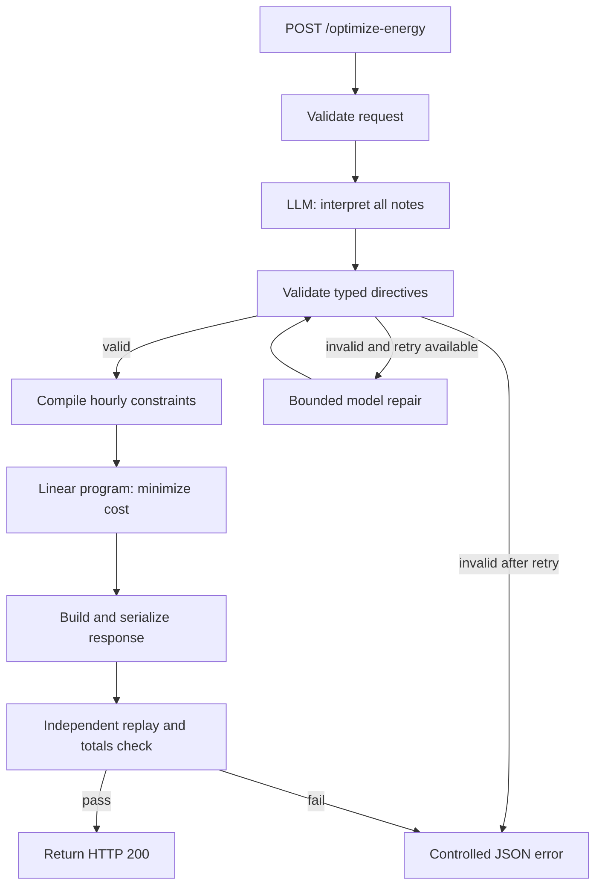

**GridWise implementation plan — two people, one dependable submission**

Prepared from the supplied participant documents on 18 September 2026. This is a proposed implementation plan; the repository currently contains the three challenge documents and no application code. Track implementation progress in [TASKS.md](../TASKS.md).

The recommended solution is a small, modular Python service: a language model interprets operator notes, deterministic code validates and compiles those interpretations, a linear program finds the cheapest valid schedule, and an independent verifier checks the exact response before it leaves the API. Use substantial AI assistance to develop and challenge each module, while keeping the production request path short and measurable.

The distinctive engineering contribution should be traceability from each note to its mathematical effect, exact optimization, and independent verification. Adding many runtime agents would only be worthwhile if measured interpretation improvements justify the added latency.

**1. Establish what the challenge actually requires**

Read these sources in this order. The problem statement controls challenge behavior; the guide controls participation, scoring, deployment, and submission.

| Local source | What it establishes |
|---|---|
| [Problem statement](../BUP_CSE_FEST_2026_Participant_Docs/BUP_CSE_FEST_2026_Preliminary_Problem_Statement_GridWise_LLM.pdf), sections 04–11 | Six directive types, exact API contract, mathematical constraints, validation, and tolerance |
| [Participant guide](../BUP_CSE_FEST_2026_Participant_Docs/BUP_CSE_FEST_2026_Participant_Guide_&_Evaluation_Rubric_GridWise_LLM.pdf), sections 02–10 | Required artifacts, four-hour round, scoring, latency thresholds, repository policy, and video |
| [Public sample pack](../BUP_CSE_FEST_2026_Participant_Docs/BUP_CSE_FEST_2026_Preli_Public_Sample_Cases.json), version 2.0 | Ten requests, expected interpretations, and valid optimal reference schedules |

The service receives exactly 24 hourly demand, solar, and tariff entries, battery parameters, and 1–3 operator notes. It must return one interpretation per note and a 24-hour schedule. Forecasting demand or weather is outside the requested problem: the forecasts are already supplied.

| Requirement | Implementation consequence |
|---|---|
| `GET /health` → HTTP 200 and `{"status":"ok"}` when ready | Provide a lightweight readiness endpoint |
| `POST /optimize-energy` | Accept and return the exact documented JSON shapes |
| A generative language model must interpret the notes used by the optimizer | A regex-only interpreter or AI-generated summary alone is ineligible |
| One directive or `no_op` per note | Preserve indexes, return every note once, and keep note order |
| Start-inclusive, end-exclusive windows | 1 PM–3 PM becomes `[13,14]` |
| Solar factor is the fraction remaining | “80% reduction” becomes `0.2`, not `0.8` |
| Reserve applies to energy after each listed hour | Do not accidentally constrain the preceding hour instead |
| No grid export; unused solar may be curtailed | Grid import is nonnegative; solar need not all be consumed |
| Battery returns to its initial energy after hour 23 | Starting energy cannot subsidize the solution permanently |
| Judge uses its own interpretation ground truth | A schedule can pass our replay and still be wrong if our language interpretation is wrong |
| Absolute comparison tolerance normally 0.01 kWh / BDT | Aim for much smaller internal errors and verify serialized output |
| Valid organizer scenarios are feasible | Unexpected infeasibility warrants investigation, not relaxed constraints |

There is no requested frontend, database, live campus integration, forecasting model, or physical battery controller. Build the API and submission artifacts first. The required three-minute video can demonstrate the API, tests, and architecture.

**2. Allocate effort according to the scoring rules**

| Category | Points | Main work protecting these points |
|---|---:|---|
| LLM directive interpretation | 25 | Semantic extraction, relevance, time windows, quantities, paraphrases |
| Directive application and constraint correctness | 25 | Compiler, optimizer, independent replay |
| Optimization quality | 10 | Exact linear programming |
| API contract and schema | 10 | Strict models, correct status codes, exact output |
| Performance and reliability | 10 | Short model path, deadlines, controlled failures |
| Deployment and Docker fallback | 10 | Public endpoint, tested pullable image, clean startup |
| Documentation and local reproducibility | 10 | Complete README and verified commands |

Half the score depends on understanding and obeying notes. Deployment and documentation together are worth twice the optimization category, so leave real time for them. The video is required and is the first tie-breaker, but has no base points.

The guide requires readiness within 60 seconds and requests within 30 seconds. Its latency bands are p95 ≤5 seconds for all three latency points, >5–15 seconds for two, and >15–30 seconds for one. Treat p95 ≤5 seconds as the preferred target, not an already demonstrated property.

**3. Freeze module boundaries before either person starts implementation**

Use one deployable service with independently testable Python modules. This makes a two-person split practical without introducing network services or duplicated deployment work.



The proposed layout below is a target structure, not a list of files that already exist.

```text
app/
  main.py                       # Endpoints and exception handlers
  config.py                     # Validated environment configuration
  contracts.py                  # Request, directive, plan, error types
  pipeline.py                   # Bounded orchestration and request deadline
  interpretation/
    provider.py                 # Model-provider interface and adapter
    interpreter.py              # Extraction, optional repair, schema handling
    prompts.py                  # Versioned instructions and small examples
    guardrails.py               # Structural and domain validation
  energy/
    compiler.py                 # Directives -> 24-hour constraint arrays
    optimizer.py                # LP construction and solve
    response.py                 # Action conversion, totals, summaries
  verification/
    replay.py                   # Independent arithmetic and directive checks
  observability.py              # Stage timing and sanitized error categories
tests/
  test_contracts.py
  test_guardrails.py
  test_compiler.py
  test_optimizer.py
  test_replay.py
  test_api.py
  fixtures/                     # Small hand-checked boundary cases
evals/
  interpretation_cases.jsonl     # New labeled language cases
  run_public.py                 # All ten official examples
  run_interpretation.py          # Live-model semantic evaluation
  benchmark_api.py               # Cold/warm latency and repeated requests
  reports/                      # Dated evaluation results
docs/
  IMPLEMENTATION_PLAN.md
TASKS.md
README.md
Dockerfile
.dockerignore
.env.example
pyproject.toml                   # Also commit a dependency lock file
```

Agree on these interfaces during the first 15 minutes:

```python
async def interpret_notes(request: EnergyRequest) -> list[Directive]: ...
def validate_directives(request: EnergyRequest, raw: object) -> list[Directive]: ...
def compile_constraints(request: EnergyRequest, directives: list[Directive]) -> ConstraintSet: ...
def solve_energy(request: EnergyRequest, constraints: ConstraintSet) -> SolverResult: ...
def build_response(request: EnergyRequest, directives: list[Directive], result: SolverResult) -> EnergyResponse: ...
def replay(request: EnergyRequest, directives: list[Directive], response: EnergyResponse) -> VerificationReport: ...
```

`ConstraintSet` contains 24-element arrays for effective solar, minimum reserve, charge limit, discharge limit, and optional grid limit. Attach source note indexes internally so a violated or binding constraint can be traced to its note. Keep these diagnostic fields out of the public response schema.

`SolverResult` carries solver status, objective, and the hourly grid, solar, signed battery flow, and battery energy. `VerificationReport` carries success, maximum residuals, and violations with hour and rule. Typed failures should distinguish invalid input, invalid interpretation, provider failure, infeasible model, solver failure, and replay failure.

**4. Split ownership so both people can make progress independently**

| Work area | Person A: language and service | Person B: energy and verification |
|---|---|---|
| Shared foundation | Own `contracts.py`; agree changes with B | Review units, numerical fields, and interfaces |
| Interpretation | Provider adapter, prompts, guardrails, language evals | Review generated interpretations against supported math |
| Scheduling | Integrate through agreed interface | Compiler, LP, result conversion, deterministic summary |
| Verification | API/status tests and live semantic tests | Independent replay and numerical tests |
| Delivery | API deployment, Docker, README commands | Public-case runner, numerical evidence, architecture/video material |
| Final acceptance | Run full pipeline externally | Reproduce image and run instructions independently |

Person B initially supplies official expected directives directly to the optimizer in tests. Person A uses a test-only solver double while connecting the endpoint and model. These are development fixtures only: every live submission request must use the actual interpretation path and optimizer.

Make small commits on separate branches, merge at the agreed gates, and assign one owner to shared files. Freeze function signatures early; propose contract changes to the other person before editing. By the first hour, replace test doubles with the real full pipeline. Each person reviews the other person's critical boundary: A checks that constraints affect schedules; B checks that language outputs have the right units and meaning.

**5. Implement the request and directive contracts first**

Use FastAPI and Pydantic for typed request/response handling. Define a discriminated union on `directive_type`; each variant permits only its specified adjustment fields. Pydantic supports strict validation and discriminated unions, which fit this boundary well. See the official [strict-mode documentation](https://docs.pydantic.dev/latest/concepts/strict_mode/) and [union documentation](https://docs.pydantic.dev/latest/concepts/unions/).

| Directive | Required `structured_adjustment` | Deterministic effect |
|---|---|---|
| `solar_reduction` | `hours`, `factor` | Solar availability becomes base solar × factor |
| `minimum_battery_reserve` | `hours`, `minimum_energy_kwh` | Raise the end-of-hour reserve floor |
| `no_charge_window` | `hours` | Set charge limit to zero |
| `no_discharge_window` | `hours` | Set discharge limit to zero |
| `max_grid_window` | `hours`, `max_grid_kwh` | Set the hourly grid-import upper bound |
| `no_op` | `null` | Leave the mathematical model unchanged |

Validate 24 unique integer hours covering 0–23, 1–3 nonempty notes, finite numeric values, nonnegative physical quantities, and physically consistent battery bounds. Sort valid input hours internally if they arrive out of order. Reject booleans masquerading as numbers or hour indexes. Accept ordinary JSON integer and decimal numbers without demanding a particular spelling. Do not impose arbitrary tariff or demand ceilings absent from the specification; negative-tariff input policy needs clarification because the supplied schema does not explicitly resolve it.

For model output, require every note index exactly once; `applies=true` for all non-`no_op` types; `applies=false` and null adjustment for `no_op`; unique ascending integer hours; finite factors in [0,1]; reserve in [0, capacity]; finite nonnegative grid caps; and no extra adjustment fields. Missing or semantically wrong information must not be silently replaced with defaults.

Return HTTP 400 for malformed JSON and structural request errors, and optionally 422 for well-formed but semantically invalid requests. FastAPI's default validation response needs an explicit handler to match this distinction; its official [error-handling guide](https://fastapi.tiangolo.com/tutorial/handling-errors/) documents overriding `RequestValidationError`. Exhausted model or internal failures should return a controlled 500, not a fabricated successful plan.

**6. Build a bounded language-agent workflow**

The initial production implementation should make one structured model call for all 1–3 notes together. Send the note indexes, note text, battery capacity needed for relative reserves, and the supported directive schema and timing rules. The model does not need to generate hourly scheduling numbers.

The prompt should state the six allowed types, exact `applies` semantics, interval convention, fraction-remaining convention, percentage-of-capacity conversion, one-entry-per-note rule, and prohibition on changing supplied demand, tariff, or battery specifications. Use a few compact examples covering semantic traps. Treat operator notes as quoted data; instructions embedded in a note cannot change the parser's schema or access tools.

Choose a model empirically. Evaluate a fast structured-output candidate and a stronger candidate on the same new labeled cases, measuring exact interpretation accuracy, invalid-output rate, p95 latency, and provider failures. Choose the fastest candidate meeting the quality gate. Model access for coding assistance does not establish that the deployed API has runtime credentials, quota, or acceptable latency; verify those separately.

The agent loop is deliberately finite:

1. Request structured interpretations using the provider's schema feature where supported.
2. Parse and deterministically validate the result.
3. If malformed or invalid, make at most one repair attempt with the original notes and concise validation errors, subject to the request deadline.
4. Validate the repaired result from scratch. A second failure returns a controlled error.
5. Compile, solve, and replay only accepted interpretations.

Use a maximum of two model attempts per request across repair and provider fallback combined. Avoid accidentally multiplying adapter retries by pipeline retries. A fallback must still be a language-capable model. An unavailable provider must never turn all notes into `no_op`.

Structural validation cannot establish that an otherwise valid `0.8` correctly represents an “80% reduction.” Cover semantic correctness with labeled evaluations and, if needed, targeted review. Do not trust the model's self-reported confidence as proof.

After the basic pipeline passes, an optional internal extraction format can include source text spans, start/end hours, and whether a quantity means “remaining fraction,” “reduction fraction,” “absolute kWh,” or “fraction of capacity.” Deterministic code can then calculate the normalized number. Keep the official public directive fields exact. Evidence spans improve diagnosis; they do not prove the model understood the note.

**7. Compile accepted directives into explicit hourly constraints**

Start from immutable request data and construct fresh arrays per request. Initialize effective solar from the provided solar, reserves from the battery's base minimum, charge/discharge limits from the battery rates, and grid limits as unbounded where no cap is given.

Apply each accepted directive only to its listed hours. For multiple reserve requirements, take the maximum with the base reserve. For multiple grid caps, take the minimum. Charge/discharge prohibitions combine by union. These operations follow the requirement to satisfy every hard constraint simultaneously.

Overlapping solar-reduction notes need special care: the statement defines each adjustment relative to original solar but does not explicitly specify how distinct factors on the same hour combine. Do not silently choose multiplication, last-write-wins, or minimum and claim that it is official behavior. Isolate this policy, seek organizer clarification, and record any necessary interim assumption and its tests. The public cases do not resolve this edge case.

Examples to verify immediately: a reserve of 50% on a 200 kWh battery becomes 100 kWh; a no-charge window must still permit discharge; and a grid cap applies to all grid imports, including energy used to charge the battery.

**8. Solve the exact mathematical problem with a compact linear program**

Use four continuous variables per hour h, for 96 variables in total:

| Variable | Meaning |
|---|---|
| `g[h]` | Grid import in kWh |
| `s[h]` | Solar actually used in kWh |
| `b[h]` | Signed battery energy change: positive charges, negative discharges |
| `e[h]` | Battery energy after the hour |

For each h = 0…23, impose:

```text
minimize sum(tariff[h] * g[h])

g[h] + s[h] - b[h] = demand[h]
e[0] - b[0] = initial_energy
e[h] - e[h-1] - b[h] = 0                    for h > 0

0 <= g[h] <= active_grid_cap[h]             upper bound absent when uncapped
0 <= s[h] <= effective_solar[h]
-active_discharge_limit[h] <= b[h] <= active_charge_limit[h]
active_minimum_reserve[h] <= e[h] <= capacity

e[23] = initial_energy
```

This signed-flow formulation is an exact fit for the specified lossless battery: every allowed hourly battery action maps to one signed number, and every signed number maps back to one allowed action. It inherently prevents simultaneous charging and discharging. It also avoids integer decisions and discretizing fractional kWh quantities.

For a no-charge hour, the upper bound on `b[h]` becomes zero. For a no-discharge hour, its lower bound becomes zero. If both apply, `b[h]=0`. All other constraints remain linear. This formulation would need reconsideration if future rules added charging losses, startup costs, or minimum on/off periods; none are specified here.

Use `scipy.optimize.linprog(method="highs")`. SciPy exposes linear equalities, inequalities, and per-variable bounds directly. Explicitly set the battery flow's negative lower bound: the solver's default is nonnegative variables. Check solver success/status before reading a solution. See the official [linprog reference](https://docs.scipy.org/doc/scipy/reference/generated/scipy.optimize.linprog.html).

This is preferable to a price-only greedy rule because the LP considers future reserves, grid caps, outages, and final neutrality together. For example, a feeder cap at 19:00 can require charging several hours earlier even when a local price rule would wait. A continuous LP also preserves fractional energy without a dynamic-programming grid.

Keep cost as the sole required objective. `peak_grid_kwh` is a reported metric, not an instruction to sacrifice cost for peak shaving. Optional tie-breaking among equal-cost schedules can be explored later, but it is not needed to match the reference schedules' quality.

On infeasibility, record the stage and constraint provenance. A remaining model attempt may re-examine the original language; it must not weaken a correctly extracted directive just to obtain feasibility. If interpretation is valid, investigate compilation and solver construction. Return a controlled failure if unresolved.

**9. Convert the solution and verify the actual outgoing response**

Convert positive `b[h]` to `charge`, negative `b[h]` to `discharge`, and genuine near-zero values to `idle` with magnitude zero. Use a small numerical threshold such as 1e-8 initially, then replay after any normalization. Do not independently round every quantity to two decimals: small energy errors can create a larger cost error after tariff multiplication.

Preserve sufficient numeric precision in JSON. Compute totals from the exact hourly values being returned:

```text
total_grid_kwh = sum(grid_kwh)
total_cost_bdt = sum(grid_kwh[h] * tariff[h])
peak_grid_kwh = max(grid_kwh)
```

Generate `plan_summary` from verified facts using a template. Mention applied restrictions, cost, and restored final battery energy. This avoids another model call and prevents unsupported savings claims. Savings require a defined, valid comparison baseline; simply keeping the battery idle may violate reserve or grid-cap directives.

The replay verifier must independently walk the plan from initial energy, check action magnitudes and rates, verify all hour balances, inspect original directives directly, check solar limits and reserves, enforce grid caps and final neutrality, and recalculate totals. It must not merely inspect the solver's own constraint matrices or reuse the compiler's adjusted arrays as its only source of truth. Otherwise one compiler bug can make both solver and checker agree on the wrong problem.

Use strict internal tolerances, initially around 1e-6 kWh for replay residuals, while reporting public comparisons using the documented 0.01 absolute tolerance. Revalidate the JSON round trip before returning 200. If normalization causes a violation, retain higher precision or correct the numerical construction and replay again; never clip values arbitrarily to conceal a bad schedule.

**10. Build tests that distinguish language failures from scheduling failures**

Use separate modes: optimizer-only tests with trusted structured directives; interpreter-only tests with labeled notes; and complete HTTP tests with the live model. This allows either person to identify the failing module without debugging the whole service at once.

All ten supplied reference schedules passed an independent arithmetic replay during preparation of this plan: energy balances, battery states/rates, listed directives, final neutrality, and totals were consistent. This check verified their feasibility and arithmetic; it did not independently certify their optimality. The sample pack labels them optimal, and the implementation should verify the LP objective against their costs.

| Sample | Main behavior exercised | Published reference cost, BDT |
|---|---|---:|
| 01 | Solar reduction plus irrelevant note | 38,365 |
| 02 | Charging maintenance | 42,885 |
| 03 | Reserve expressed as percentage of capacity | 35,480 |
| 04 | Discharge prohibition during expensive hours | 40,495 |
| 05 | Feeder import cap requiring preparation | 33,950 |
| 06 | Solar, charging restriction, and distractor | 34,090 |
| 07 | Reserve combined with transformer cap | 38,550 |
| 08 | Separate charge and discharge outages | 37,665 |
| 09 | “80% reduction” normalization | 34,873 |
| 10 | Evening reserve, grid cap, and distractor | 41,620 |

Compare interpretations structurally, ignoring free-text explanation wording. Compare schedules by validity and objective, not by exact hourly equality: many optimal schedules may exist. Likewise, do not require an identical peak value if another feasible schedule has the same optimal cost.

Build an initial 60-case semantic suite with at least ten independently checked examples per directive type, then expand only where errors appear. Include new quantities and phrasings, 12 AM/noon, 24-hour notation, single-hour intervals, percentages and fractions, irrelevant notes containing energy words, and mixes of 1–3 notes. Hold out a portion of cases before prompt tuning. Exclude genuinely ambiguous organizer-policy cases from the strict accuracy score until their expected semantics are established.

Numerical tests should include surplus solar and curtailment, zero solar, zero charge/discharge rates, flat and zero tariffs, fractional quantities, reserve equal to capacity, caps requiring advance charging, restrictions in the final hour, and initial energy at a bound. Validate supported degenerate inputs without assuming all hidden values resemble public samples.

Add metamorphic checks whose expected relationship follows from the rules:

| Transformation | Expected result |
|---|---|
| Paraphrase a note without changing meaning | Same structured directive |
| Reorder notes | Same feasible optimization problem; note indexes follow the new order |
| Add an irrelevant note while staying within three notes | One additional `no_op`; unchanged optimum |
| Scale demand, solar, capacity, reserves, rate limits, and absolute directive quantities by the same positive factor | Feasibility scales; optimal cost scales with unchanged tariffs |
| Tighten a grid cap or raise a reserve while keeping the case feasible | Minimum cost cannot decrease |
| Increase available solar | Minimum cost cannot increase because curtailment is allowed |

Test verifier independence by deliberately corrupting a plan: change one grid value, exceed a cap, alter the final battery energy, mismatch totals, or turn a nonzero action into idle. Each mutation must be detected. Separately inject bad model output, timeouts, authentication failures, and throttling into the provider adapter; confirm bounded attempts and controlled responses.

Record exact semantic match rate, per-directive failures, downstream feasibility rate, objective differences, p50/p95 latency, model-call count, and error categories. Initial acceptance targets are 10/10 public cases, no known constraint failures, zero malformed successful responses, and all unambiguous held-out interpretation cases correct before adding features. These are engineering targets, not promises about hidden-test performance.

**11. Use large agentic support where it creates measurable value**

Both developers can use coding agents on bounded work inside their owned modules. Provide each agent the frozen interfaces, relevant specification excerpts, files it may edit, and acceptance tests. Human owners review the result and understand the submitted architecture, consistent with the guide's AI-assistance policy.

| Agent role during development | Concrete deliverable | Acceptance boundary |
|---|---|---|
| Specification reviewer | Requirement-to-test mapping and ambiguous-rule list | Every claimed rule has a supplied source |
| Language adversary | Paraphrases, distractors, and minimal meaning changes | Labels independently checked before use |
| Numerical reviewer | Counterexamples for greedy scheduling and boundary cases | Replay and objective checks determine correctness |
| Independent test author | Black-box tests written from the specification | Does not simply duplicate implementation logic |
| Deployment reviewer | Clean-room run of README and Docker commands | Public endpoint and image are actually usable |

Three useful extensions can distinguish the submission once the core is stable:

**Traceable interpretations.** Store an internal chain from original note, to normalized directive, to affected hourly bounds, to replay results. This makes it possible to show exactly how “50% reserve” becomes a mathematical constraint and appears in the returned schedule. A verification record demonstrates checked feasibility, not proof of language understanding.

**Selective semantic review.** Use a second model only for reproducible trouble patterns or a failed first attempt, within the same two-attempt budget. A reviewer can challenge “reduced by” versus “reduced to,” percentage reserves, or dubious relevance decisions. Measure its accuracy gain and p95 impact before enabling it. Do not automatically select whichever interpretation produces the lowest energy bill.

**Counterfactual explanation.** After the main result is verified, optionally re-solve locally with one restriction removed to estimate that restriction's marginal cost while retaining all others. This supports statements such as “under this scenario, this restriction adds X BDT.” Explain that effects can interact and do not generally sum. Keep this out of the critical path until tested, and do not add unauthorized response fields.

Avoid introducing retrieval infrastructure for these short, fixed rules, a vector database, model fine-tuning, a runtime agent debate, or learned dispatch policies during the four-hour implementation. The judge rewards semantic generalization and correct numerical behavior; use experiments to justify additional complexity.

**12. Make reliability and deployment part of the implementation**

Use a small Python/FastAPI container with pinned dependencies, Pydantic, SciPy/HiGHS, a chosen provider SDK or HTTP adapter, pytest, and an HTTP test client. Pin mutually compatible versions after verifying installation on the deployment architecture. Keep provider-specific code behind one interface so changing the model does not change the optimizer.

Suggested environment names are `LLM_PROVIDER`, `LLM_MODEL`, `LLM_API_KEY`, optional `LLM_BASE_URL`, optional backup-model configuration, `LLM_TIMEOUT_SECONDS`, `REQUEST_DEADLINE_SECONDS`, `MAX_INFLIGHT_MODEL_CALLS`, and `PORT`. Document required versus optional values in `.env.example` without real secrets.

Adopt an initial total request deadline of 27 seconds to leave margin below the judge's 30-second cutoff. Start with an eight-second cap per model attempt, at most two attempts, and reserve the remaining budget for queueing, solving, verification, and serialization. The normal successful path should still target a model response around four seconds or less to reach p95 ≤5 seconds. Benchmark and adjust these proposed budgets on the actual host.

Use asynchronous provider I/O, a reused client, bounded concurrent model calls, and deadline-aware queueing. Run blocking solve work outside the async event loop, and avoid unlimited native-solver thread contention. Measure realistic concurrent traffic as well as sequential requests. Cancellation must stop further retries.

For `/health`, verify startup configuration and local solver readiness without making a paid model call per probe. Perform a separate model smoke test when deploying. A ready process and a working external model are distinct checks; both must be tested before submission.

An interpretation cache is optional and lower priority. If used, cache only previously validated model-produced results, include exact note content and relevant battery context plus model/prompt/schema versions in the key, and revalidate on retrieval. Do not key by `scenario_id` or approximate wording. Keep live interpretation as the default until any uncertainty about per-request model-use expectations is resolved. Benchmark uncached requests so caching cannot hide provider latency.

Build for the host's architecture, bind to `0.0.0.0`, expose the documented port, and run with secrets supplied at runtime. Test image pull and startup from a clean environment. Submit an exact accessible tag or digest, and keep both the image and endpoint available during judging. Deployment and publishing are implementation-stage tasks; this planning pass does not publish anything.

**13. Execute within the stated four-hour round**

This is a relative schedule from the implementation start, aligned with the guide's 7–11 PM round. It is not a claim about the organizer's calendar date or time remaining. If more time is available, use it to expand evaluation after the same gates pass.

| Elapsed time | Person A | Person B | Gate and reason |
|---|---|---|---|
| 0–15 min | Agree contracts, verify runtime model access, scaffold API | Agree math and interfaces, load samples | Frozen contracts prevent parallel work diverging |
| 15–50 min | Implement batched interpretation and guardrails; start deployment skeleton | Implement compiler, signed-flow LP, response builder, and replay | Each half works independently; solver matches trusted public directives |
| 50–75 min | Integrate real model, API errors, and provider deadlines | Integrate replay and public-case runner | First complete live-model HTTP path; run all ten cases |
| 75–120 min | Fix semantic failures; build held-out language evals | Fix numerical/serialization failures; add targeted boundary and mutation tests | Core correctness gate; no stretch features before this passes |
| 120–160 min | Build/publish tested image and deploy service | Benchmark live endpoint and test provider failures | Reachable deployment with working fallback |
| 160–190 min | Complete README and exact commands | Reproduce image/README independently; run unseen paraphrases | Fresh-environment reproducibility gate |
| 190–215 min | Record video using measured results | Review video and finalize test evidence | Required video ≤3 minutes and accessible |
| 215–240 min | Verify submission links, secrets policy, and required fields | Final external smoke run and fallback check | Freeze features; retain time for delivery problems |

If behind schedule, drop counterfactuals, caching, second-model semantic review, and any UI work. Preserve the required language interpretation, deterministic validation, exact solver, replay, deployment, image, README, and video. Diagnose whether failures come from interpretation or energy math before changing both at once.

**14. Resolve genuine specification gaps without inventing official rules**

| Open point | Why it matters | Planned handling |
|---|---|---|
| Multiple solar-reduction notes overlap on the same hour | Multiplication, minimum, and overwrite can give different schedules | Ask organizers; isolate composition policy and document any interim assumption |
| Windows wrap midnight or say “through” an hour | Hour arrays depend on the precise horizon convention | Follow explicit examples; add a normalization policy after clarification |
| Tariff sign and numerical input extremes | Extra validation could reject valid inputs; extreme magnitudes affect precision | Avoid arbitrary bounds, clarify unsupported domains, and test scaling |
| Exact hidden concurrency/provider limits | Determines queueing and failure risk | Measure and provision runtime quota; set bounded concurrency |
| Model provider and deployment platform | Team credentials and access are not supplied in the folder | Select in the initial setup gate based on measured viability |

The guide's displayed zero-optimum scoring formula is visibly cut off after one branch. Implement objective and validity checks from the complete requirements; do not invent an official scoring branch. A zero-cost valid solution should still be tested locally.

Record organizer answers in the repository and update compiler tests immediately. These gaps do not block the documented public-case path or most implementation work.

**15. Define completion in terms of reviewable evidence**

The implementation is complete when the real-model service passes all ten public cases, succeeds on a separate unambiguous paraphrase set, returns only independently replayed schedules, matches reference costs within tolerance, and handles provider failures without crashing or inventing directives. Retain reports identifying model, prompt version, code revision, latency, and tested case count.

Delivery also requires the publicly reachable service, a tested pullable Docker image, a fresh-environment README run, source and dependency files, and an accessible video no longer than three minutes. The guide requires a repository created after question reveal, private during the event and public after the deadline. Confirm that history and visibility at submission; a local Git checkout alone does not establish compliance.

The first implementation action is for both people to agree on `contracts.py`, the signed battery convention, and the six directive variants. Then Person A can build interpretation while Person B builds exact scheduling using the supplied reference directives. Keep [TASKS.md](../TASKS.md) updated at each gate with evidence rather than marking work done merely because code was generated.
